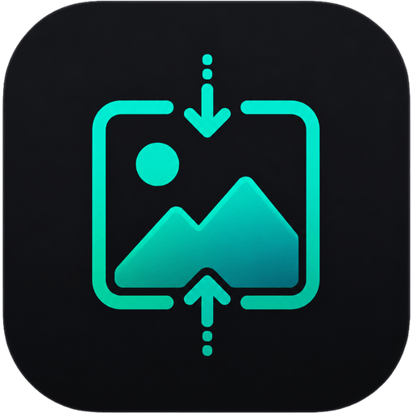

<div align="center">



# ImageSquish

**Compress JPEG, PNG and WebP images to fit any upload limit, in your browser or the terminal.**

So the screenshot you want to post fits under Discord's 10 MB cap, and your avatar
squeezes under GitHub's 1 MB limit, without you guessing at quality sliders.

<p>
  <a href="https://www.npmjs.com/package/imgsquish"></a>
  <a href="https://www.npmjs.com/package/imgsquish"></a>
  
  
  
</p>

<p>
  <a href="https://imgsquish.riyo.me"><b>▶ Live web app</b></a>
  &nbsp;·&nbsp;
  <a href="https://www.npmjs.com/package/imgsquish">npm</a>
  &nbsp;·&nbsp;
  <a href="#️-cli">CLI</a>
  &nbsp;·&nbsp;
  <a href="#-how-it-works">How it works</a>
</p>

</div>

---

## ✨ What it does

Most images are far bigger than they need to be. `imgsquish` **keeps the original
format** and just makes the file smaller, by lowering quality (JPEG / WebP) or reducing
the color count (PNG), and can cap the dimensions. Converting to WebP is there too for
the smallest result.

The headline feature is **fit under a size limit**: give it a target like a GitHub
avatar (1 MB) or Discord's 10 MB cap and it binary-searches the highest quality that
fits, downscaling only if it has to.

| | |
| --- | --- |
| 🎯 **Fit under a size limit** | 57 targets across 10 categories (GitHub, Discord, Gmail, and more) |
| 🖼️ **Keeps your format** | Shrink a PNG by reducing colors, JPEG / WebP by quality |
| 📐 **Resize** | Cap the longest side, the biggest lever for oversized photos |
| 🗜️ **WebP convert** | Optional, when you want the smallest possible file |
| 💎 **Quality-first** | The fit search maximizes quality, downscaling only as a last resort |
| 🔒 **Private** | Web app runs 100% in the browser, nothing uploaded |
| 📦 **Zero-install CLI** | Powered by sharp, just `npx imgsquish` |
| 📲 **Installable PWA** | Works offline once loaded |

## 🖥️ Two ways to use it

- **Web app**: drag & drop, pick a target, compare *before / after*, download. Nothing
  is uploaded. → **https://imgsquish.riyo.me**
- **CLI**: batch-process folders from the terminal with `npx imgsquish`.

### AI agents

Use this short prompt when you want an AI agent to install the reusable Skill or handle one request with `npx`:

```text
Read https://imgsquish.riyo.me/ai and follow its instructions to handle the request below. If I want reusable future support and have not installed the project Skill, explain or perform the Skill installation. Otherwise use the one-off npx method. If my choice, intent, or input files are unclear, ask before acting. Respond in the user's language. Do not process files merely because you read the page.

Request: <describe what you want done>
```


---

## ⌨️ CLI

```bash
# Single file, keeps its format, writes photo-min.jpg next to it
npx imgsquish photo.jpg

# Compress a whole folder into a new one
npx imgsquish ./images -o ./images-min

# Fit under a platform's limit (quality chosen automatically)
npx imgsquish -s discord clip.png
npx imgsquish -s github-avatar -m 500 avatar.png

# Squeeze PNG screenshots harder (fewer colors)
npx imgsquish -p small "shots/*.png"

# See the savings without writing anything
npx imgsquish --dry-run ./images
```

### Presets

| id         | Output          | Best for                                   |
| ---------- | --------------- | ------------------------------------------ |
| `balanced` | keep format q80 | Default. Smaller with no visible loss.     |
| `small`    | keep format q60 | A stronger squeeze, still the same format. |
| `high`     | keep format q92 | Barely any loss, modest savings.           |
| `webp`     | WebP q80        | Smallest result, if you can change format. |

### Size targets

Pass a size (`--max-size 500KB`, `10MB`) or a target id (`--max-size discord`). There
are **57 targets across 10 categories**:

| Category      | Targets                                                                    |
| ------------- | -------------------------------------------------------------------------- |
| Social        | X (2 MB), Reddit (5 MB), LinkedIn (8 MB), TikTok (10 MB), Pinterest (32 MB) |
| Video         | YouTube thumbnail (2 MB) & banner (6 MB), Kick (4 MB), Vimeo (5 MB), Twitch (10 MB) |
| Messaging     | Discord (10 / 50 / 500 MB), WhatsApp (16 MB), Messenger (25 MB), Teams, Signal (100 MB), Slack, LINE (1 GB), Telegram (2 GB) |
| Email         | iCloud & Zoho (20 MB), Gmail, Outlook, Yahoo, Proton (25 MB)               |
| Developer     | GitHub avatar (1 MB) & upload (10 MB), Bitbucket (1 MB), Stack Overflow (2 MB), GitLab (100 MB) |
| Community     | Bluesky (1 MB), Discourse (10 MB), Mastodon (16 MB), Reddit post (20 MB)   |
| E-commerce    | Amazon, Etsy, Mercari (10 MB), eBay (12 MB), Shopify (20 MB)               |
| Productivity  | Notion (5 MB), Trello (10 MB), Google Docs (50 MB), Confluence, Asana (100 MB) |
| Image hosting | Cloudinary (10 MB), Imgur (20 MB), ImgBB & Postimages (32 MB), Flickr (100 MB) |
| Blogging      | Ghost (5 MB), Substack (10 MB), Squarespace & Tumblr (20 MB), Medium & Wix (25 MB) |

<details>
<summary><b>All 57 target ids</b> (for <code>--max-size &lt;id&gt;</code>)</summary>

| id | Target | id | Target |
| --- | --- | --- | --- |
| `twitter-avatar` | X / Twitter avatar · 2 MB | `github-avatar` | GitHub avatar · 1 MB |
| `reddit-avatar` | Reddit avatar · 5 MB | `bitbucket` | Bitbucket attachment · 1 MB |
| `linkedin-avatar` | LinkedIn photo · 8 MB | `stackoverflow` | Stack Overflow image · 2 MB |
| `tiktok-avatar` | TikTok avatar · 10 MB | `github` | GitHub image upload · 10 MB |
| `pinterest-avatar` | Pinterest avatar · 32 MB | `gitlab` | GitLab attachment · 100 MB |
| `youtube-thumbnail` | YouTube thumbnail · 2 MB | `bluesky` | Bluesky post image · 1 MB |
| `kick-avatar` | Kick avatar · 4 MB | `discourse` | Discourse image · 10 MB |
| `vimeo-avatar` | Vimeo avatar · 5 MB | `mastodon` | Mastodon image · 16 MB |
| `youtube-banner` | YouTube banner · 6 MB | `reddit-post` | Reddit image post · 20 MB |
| `twitch-avatar` | Twitch avatar · 10 MB | `amazon-seller` | Amazon product image · 10 MB |
| `twitch-banner` | Twitch banner · 10 MB | `etsy` | Etsy listing photo · 10 MB |
| `discord` | Discord (free) · 10 MB | `mercari` | Mercari photo · 10 MB |
| `whatsapp-photo` | WhatsApp photo · 16 MB | `ebay` | eBay listing photo · 12 MB |
| `messenger-attachment` | Messenger attachment · 25 MB | `shopify` | Shopify product image · 20 MB |
| `discord-nitro-basic` | Discord Nitro Basic · 50 MB | `notion` | Notion (free) file · 5 MB |
| `microsoft-teams` | Microsoft Teams chat · 100 MB | `trello` | Trello (free) attachment · 10 MB |
| `signal` | Signal attachment · 100 MB | `google-docs` | Google Docs image · 50 MB |
| `discord-nitro` | Discord Nitro · 500 MB | `confluence` | Confluence attachment · 100 MB |
| `slack` | Slack (free) file · 1 GB | `asana` | Asana attachment · 100 MB |
| `line` | LINE file · 1 GB | `cloudinary` | Cloudinary (free) · 10 MB |
| `telegram` | Telegram (free) file · 2 GB | `imgur` | Imgur image · 20 MB |
| `icloud-mail` | iCloud Mail · 20 MB | `imgbb` | ImgBB (free) · 32 MB |
| `zoho-mail` | Zoho Mail (free) · 20 MB | `postimages` | Postimages (free) · 32 MB |
| `gmail` | Gmail attachment · 25 MB | `flickr` | Flickr (free) photo · 100 MB |
| `outlook` | Outlook.com attachment · 25 MB | `ghost` | Ghost(Pro) Starter · 5 MB |
| `yahoo-mail` | Yahoo Mail attachment · 25 MB | `substack` | Substack image · 10 MB |
| `proton-mail` | Proton Mail attachment · 25 MB | `squarespace` | Squarespace image · 20 MB |
| | | `tumblr` | Tumblr image · 20 MB |
| | | `medium` | Medium image · 25 MB |
| | | `wix` | Wix image · 25 MB |

</details>

Limits are researched from each platform's public documentation and change over time.
Run `npx imgsquish --list-targets` for the current list. ImageSquish is not affiliated
with or endorsed by any listed service. All product names are trademarks of their
respective owners.

### Options

```
-p, --preset <id>     Compression preset (default: balanced)
-q, --quality <1-100> Override the preset's quality (for PNG, the color count)
-f, --format <fmt>    Output format: keep, jpeg, png, webp (default: preset)
-m, --max <px>        Resize so the longest side is at most <px>
-s, --max-size <size> Fit under a size limit: a size (500KB, 10MB) or a target name
    --keep-metadata   Preserve EXIF / ICC metadata (stripped by default)
    --lossless        Lossless WebP output
    --dry-run         Report savings without writing files
    --list-presets    List presets and exit
    --list-targets    List size targets and exit
-h, --help            Show help
```

---

## 🔬 How it works

For a size target, `imgsquish` binary-searches the highest quality that lands under the
limit, and only downscales if even the lowest quality is still too big. Keeping the
format, PNG is shrunk by reducing its color count and JPEG / WebP by encoder quality.
The CLI does this natively with [sharp](https://sharp.pixelplumbing.com/). The web app
implements the same fit search with the Canvas API and processes images entirely
client-side, so nothing is ever uploaded.

## 🧩 Project structure

This is an npm-workspaces monorepo:

```
packages/
  core/   shared presets, size targets + helpers (dependency-free TS)
  cli/    the npx tool  →  published to npm as "imgsquish"
  web/    Vite + React + TypeScript PWA  →  deployed on Vercel
```

```bash
npm install            # install all workspaces
npm run dev:web        # run the web app locally
npm run build:cli      # build the CLI → packages/cli/dist
npm run build:web      # build the web app → packages/web/dist
```

## 📄 License

[MIT](LICENSE) © Riyoway
